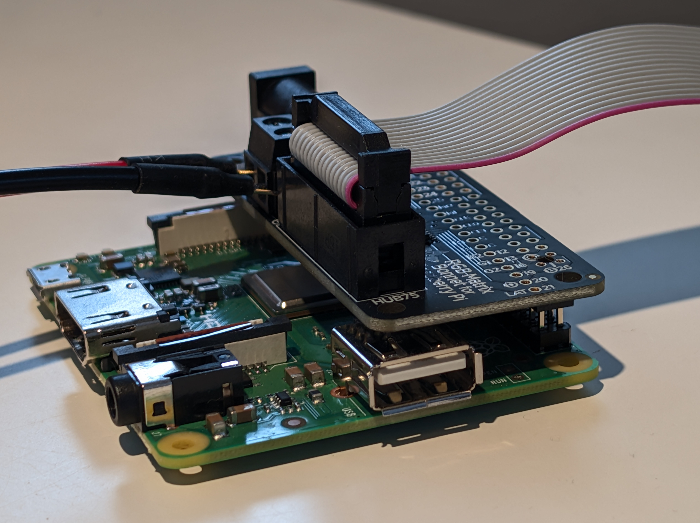
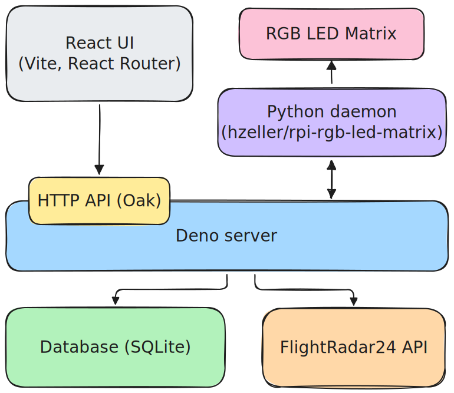

# Flight monitor

A hobby project for detecting flights that fly over user-defined geographic bounding boxes (e.g., my apartment) and displaying them on an RGB LED matrix.

Consists of a Deno server and a Python daemon that drives the LED matrix. The deno server handles serving a configuration UI (React), fetching and persisting the flight data, and communicating with the Python daemon.

## Demo

When there are active flights inside the configured bounding box, the details of each flight are displayed one by one. Details include:

- Origin and destination airports
- Flight number
- Airline & callsign
- Aircraft model type
- Altitude

https://github.com/user-attachments/assets/edf8e38d-aae8-430e-9075-67d9735ad0c6

When there are no flights, the current date & time are displayed along with a reference airport's temperature and METAR (weather report). In addition, the Finnish electricity prices (pörssisähkö) for the next 8 hours are displayed as a scrolling list after the METAR.

https://github.com/user-attachments/assets/ee900ffc-51d9-4ed7-9563-dd0824465d0f

## Hardware

- Raspberry Pi 3 Model A+
- 32x64 RGB LED Matrix from AliExpress
- Adafruit RGB Matrix Bonnet + 5V/2A power supply
- A wooden box




## Software

- **Backend:** Deno (using Oak framework)
- **Frontend:** React + TypeScript + Vite
- **Database:** SQLite
- **LED Matrix:** Python 3 with [hzeller/rpi-rgb-led-matrix](https://github.com/hzeller/rpi-rgb-led-matrix) library

### Data Source

The server polls for real-time flights and their details in a user-defined bounding box via unofficial Flightradar24 API. The data is stored in a SQLite database and persisted across restarts.

### High-level architecture



## Setup

### Prerequisites

- Deno
- Python 3
- Raspberry Pi with a RGB LED matrix (or development machine for testing)

### Install Dependencies

```bash
# Install Python LED matrix library
# Follow instructions for installing the Python bindings at: https://github.com/hzeller/rpi-rgb-led-matrix/tree/master/bindings/python

# Install Deno dependencies
deno install

# Build the UI and serve the application
deno run build:ui
deno run --allow-all main.ts
```

Note: building the UI with `deno run build:ui` can be a heavy operation on a Raspberry Pi and it might not even complete at all due to Pi's limited memory. You can alternatively build it on a more powerful machine and transfer the resulting `dist` directory to the Raspberry Pi.

### Configuration

Configuration of the server is done via the `config.ts` file in the project root.

Configuration of the client UI is done via the `ui/config-ui.ts` file. The UI configuration expects a Mapbox access token set in the environment variable `VITE_MAPBOX_ACCESS_TOKEN`.

**UI Configuration:** Access the web UI to configure:

- Bounding box coordinates for flight detection
- Reference airport for METAR/weather data
- Display brightness

The configuration is stored in SQLite and persists across restarts.

## License

MIT License
